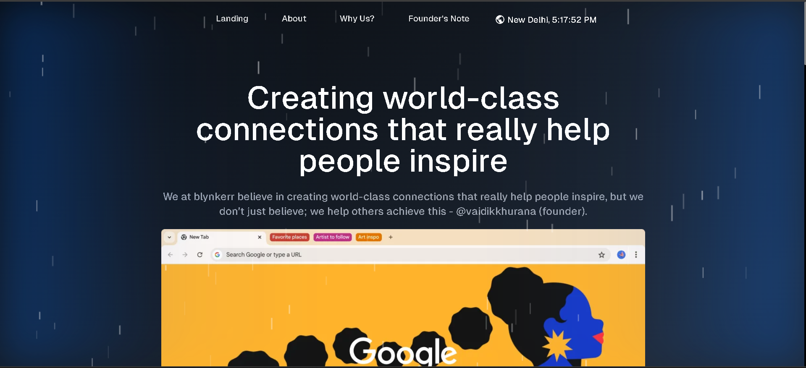

# Blynkerr Landing Page

Welcome to the repository for the **Blynkerr Landing Page**! This page serves as the gateway to Blynkerr’s offerings, providing a sleek, responsive, and user-friendly interface to introduce users to the platform.

## Features

- **Responsive Design**: Fully optimized for all screen sizes, including mobile, tablet, and desktop.
- **Interactive Elements**: Smooth animations and dynamic content to engage visitors.
- **Fast Loading**: Built with performance in mind, ensuring quick load times.
- **Easy Customization**: Modular and well-structured code for effortless updates.

## Tech Stack

- **Frontend**: HTML5, TailwindCSS, JavaScript, Next.JS
- **Framework**: Bootstrap 5, next.js
- **Assets**: Some assets from fonts.google.com and google.com/assets

For questions or support, feel free to reach out:

- **Email**: vaidikkhurana@gmail.com
---

Thank you for visiting and contributing to the Blynkerr Landing Page! Together, we can build an amazing experience for our users.

